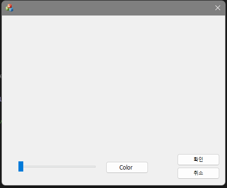
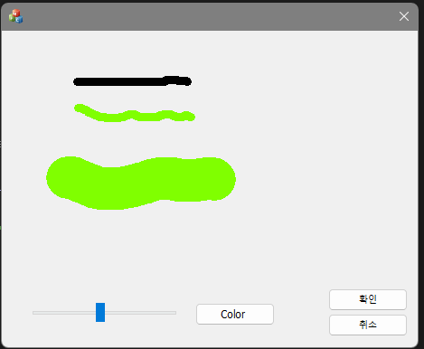
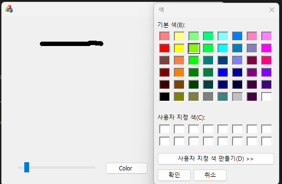

# 230911

비쥬얼프로그래밍 과제 </br>
컴퓨터공학과 20191276 양용석</br>

작성 코드 </br>

```
CPoint oPnt; // 전역변수 설정 

COLORREF col; //  색상 변경을 위한 전역변수 설정

int n; // 마우스 포인터의 굵기를 설정하기 위한 변수


void CMFCApplication2Dlg::OnMouseMove(UINT nFlags, CPoint point) // 마우스 포인터의 위치를 따라 선이 그어짐, n은 굵기이며 col은 색상
{	if (nFlags == MK_LBUTTON) {
		CPen pen(PS_SOLID, n, col); 
		CClientDC dc(this);
		dc.SelectObject(&pen);
		dc.MoveTo(oPnt);
		dc.LineTo(point);
	}
	oPnt = point;  // 마우스 포인터의 업데이트
	CDialogEx::OnMouseMove(nFlags, point);
}
//버튼 클릭시 색상 설정 가능
void CMFCApplication2Dlg::OnBnClickedButton1()
{
	CColorDialog dlg;
	if (dlg.DoModal() == IDOK) {
		col = dlg.GetColor();
	}
}

//슬라이드 컨트롤에 따라 선의 굵기 변경
void CMFCApplication2Dlg::OnNMCustomdrawSlider1(NMHDR* pNMHDR, LRESULT* pResult)
{
	LPNMCUSTOMDRAW pNMCD = reinterpret_cast<LPNMCUSTOMDRAW>(pNMHDR);
	CSliderCtrl* m_Slide = reinterpret_cast<CSliderCtrl*>(GetDlgItem(IDC_SLIDER1)); // 슬라이더 컨트롤 객체 가져오기
	if (m_Slide != nullptr)
	{
		n = m_Slide->GetPos(); // 슬라이더 컨트롤의 현재 위치(값)을 가져와서 n에 저장
		*pResult = 0;
	}
}
```

실행 화면 </br>
</br>
</br>
</br>
